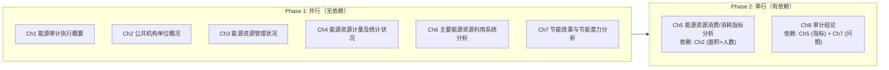

# Hermes Agent — 能源审计报告编制流程图

> 同方德诚 · 公共机构能源审计 · 多Agent协同流水线 v3.0
>
> 四Agent协同：**小数**（数据采集）→ **小诚**（知识检索）→ **小方**（指标计算）→ **小同**（报告生成）

## 主流程图

```mermaid
flowchart TD
    %% ====== 数据源层 ======
    PG[("🗄️ PostgreSQL<br/>dc_energy_audit2<br/>ts_institution_energy_main/data")]
    CFG[("📋 Config JSON<br/>unit_name · buildings<br/>equipment · metering")]
    QD[("📚 Qdrant 向量库<br/>knowledge_segment_qwen<br/>历史报告 · DB37/T")]

    %% ====== Step 0: Config校验 ======
    PG --> XS
    CFG --> XS
    CFG --> V0

    V0["Step 0<br/>📋 Config 校验<br/>config_validator.py"]
    V0 --> |"✅ 通过"| XS

    %% ====== Agent 1: 小数 ======
    XS["🔵 Agent 1: 小数<br/>Xiaoshu<br/>项目数据初始化<br/>三层回退策略"]
    XS --> |"AuditProject"| BRD

    %% ====== Agent 2: 小诚 ======
    QD --> XC
    CFG --> XC
    XC["🔵 Agent 2: 小诚<br/>Xiaocheng<br/>RAG检索 + 定额对标<br/>search_for_chapter()"]
    XC --> |"chapter_refs<br/>_benchmarks"| BRD

    %% ====== Agent 3: 小方 ======
    XS --> XF
    XF["🔵 Agent 3: 小方<br/>Xiaofang<br/>能耗指标计算<br/>indicators.py"]
    XF --> |"energy_data<br/>baselines<br/>indicators"| BRD

    %% ====== Step 4: 构建 Report Data ======
    BRD["Step 4<br/>📊 构建 Report Data (rd)<br/>build_rd_from_project()<br/>合并所有Agent输出"]

    %% ====== Step 4.0: 异常检测 + KG诊断 ======
    BRD --> AD
    AD["Step 4.0<br/>🔬 能耗异常检测<br/>analyze_with_diagnosis()<br/>年度对比 · 逐月异常 · 数据缺失"]
    AD --> KG
    KG["Step 4.0<br/>🧠 KG 因果诊断<br/>EnergyKnowledgeGraph<br/>50+因果链 × 12用能系统<br/>诊断原因 → 推荐措施 → 置信度"]
    KG --> SAVE
    SAVE["Step 4.0<br/>💾 持久化分析结果<br/>~/.hermes/projects/{unit}/<br/>analysis_result.json"]

    %% ====== 用户确认闸门 ======
    SAVE --> GATE
    GATE{"⚠️ 用户确认闸门<br/>pending_count = ?"}
    GATE --> |"❌ pending > 0<br/>流程中断"| EDIT["编辑 analysis_result.json<br/>confirmed: true<br/>is_data_error: false<br/>填写 reason<br/><br/>→ 重新运行流水线"]
    EDIT --> |"重新运行"| V0
    GATE --> |"✅ 全部确认"| INJECT

    %% ====== Step 4.0a: 诊断注入 + 反馈 ======
    INJECT["Step 4.0a<br/>💉 KG诊断注入第7章<br/>inject_diagnosis_to_chapter7()<br/>problems[] · solutions[] · summary"]
    INJECT --> FEEDBACK
    FEEDBACK["Step 4.0a<br/>📈 置信度反馈更新<br/>kg_fb.record_feedback()<br/>用户确认 → 正面反馈<br/>save_feedback()"]

    %% ====== Step 4.1: 合并用户文本 ======
    FEEDBACK --> MERGE
    MERGE["Step 4.1<br/>📝 合并用户 LLM 文本<br/>chapter_texts → rd<br/>数据完整性检查<br/>check_completeness()"]

    %% ====== Step 4.5: 照片检查 ======
    MERGE --> PHOTO
    PHOTO["Step 4.5<br/>📸 照片检查清单<br/>photo_manager<br/>非阻断，仅提示"]

    %% ====== Agent 4: 小同 ======
    PHOTO --> XT
    XT["🔵 Agent 4: 小同<br/>Xiaotong<br/>主编组装 + Word生成<br/>ReportGenerator('公共机构')"]
    XT --> |"generate_word()"| DOCX

    DOCX["📄 Word 报告 (.docx)<br/>{unit_name}_能源审计报告.docx<br/>8章完整结构"]

    %% ====== Step 6: 自动质检 ======
    DOCX --> QA
    QA["Step 6<br/>✅ 自动质检 QA<br/>report_qa.check_report()<br/>warnings[] · issues[]"]
    QA --> DONE

    DONE["🎉 流水线完成<br/>返回 .docx 路径"]

    %% ====== 样式 ======
    classDef agent fill:#e8f0fa,stroke:#005ab4,stroke-width:2px,color:#1a1c1e
    classDef step fill:#f7f8f9,stroke:#d5d9dd,stroke-width:1.5px,color:#1a1c1e
    classDef datasource fill:#fefaf6,stroke:#e8833a,stroke-width:1.5px,stroke-dasharray:5,color:#1a1c1e
    classDef decision fill:#fefafa,stroke:#c0392b,stroke-width:2px,color:#1a1c1e
    classDef output fill:#f6fdf9,stroke:#2d8a56,stroke-width:2px,color:#1a1c1e

    class XS,XC,XF,XT agent
    class V0,BRD,AD,KG,SAVE,INJECT,FEEDBACK,MERGE,PHOTO,QA step
    class PG,CFG,QD datasource
    class GATE,EDIT decision
    class DOCX,DONE output
```



## 报告结构（8章）



## Agent 角色总览

| Agent | 名称 | 职责 | 核心文件 | 数据源 | 三层回退 |
|-------|------|------|----------|--------|----------|
| 🔵 **小数** | 数据初始化 Agent | 项目数据采集 | `pg_collector.py` | PostgreSQL | DB → Config → 内置值 |
| 🔵 **小诚** | 知识检索 Agent | RAG搜索 + 定额对标 | `rag_search.py` | Qdrant 向量库 | DB → 用户 → 内置标准 |
| 🔵 **小方** | 计算 Agent | 能耗指标 + 基准值 | `indicators.py` | AuditProject | — |
| 🔵 **小同** | 主编 Agent | 组装 + 生成Word | `report_generator.py` | report_data 字典 | — |
| 🧠 **KG** | 知识图谱引擎 | 因果诊断 + 置信度学习 | `energy_kg.py` (75KB) | 50+因果链 × 12系统 | — |

## 关键数据流

```
Config JSON
  → 小数(pg_collector) → AuditProject
  → build_rd_from_project() → report_data (rd)

rd → 小方(indicators) → chapter5.energy_data + baselines

rd + tags → 小诚(rag_search) → chapter_refs + _benchmarks

rd.chapter5.energy_data
  → analyze_with_diagnosis() → AnalysisResult
  → 🔴 用户确认闸门
  → inject_diagnosis_to_chapter7()
  → chapter7.problems + solutions

rd (完整) → 小同(ReportGenerator)
  → 📄 {unit_name}_能源审计报告.docx
  → report_qa.check_report() → 🎉 完成
```

## 技术标准

| 标准 | 适用范围 |
|------|----------|
| GB/T 2589-2020 | 综合能耗计算通则（国标） |
| DB37/T 2672-2674-2019 | 山东省公共机构能耗定额标准 |
| DB37/T 标准系列 | 山东省机构/建筑/工业审计规范 |

## 机构类型支持

| 类型 | institution_category | 定额标准 |
|------|---------------------|----------|
| 🏥 医疗 | `medical` | DB37/T 医疗类定额 |
| 🏛️ 党政机关 | `government` | DB37/T 机关类定额 |
| 🎓 教育 | `education` | DB37/T 教育类定额 |
| 🏟️ 体育场馆 | `sports` | DB37/T 场馆类定额 |
