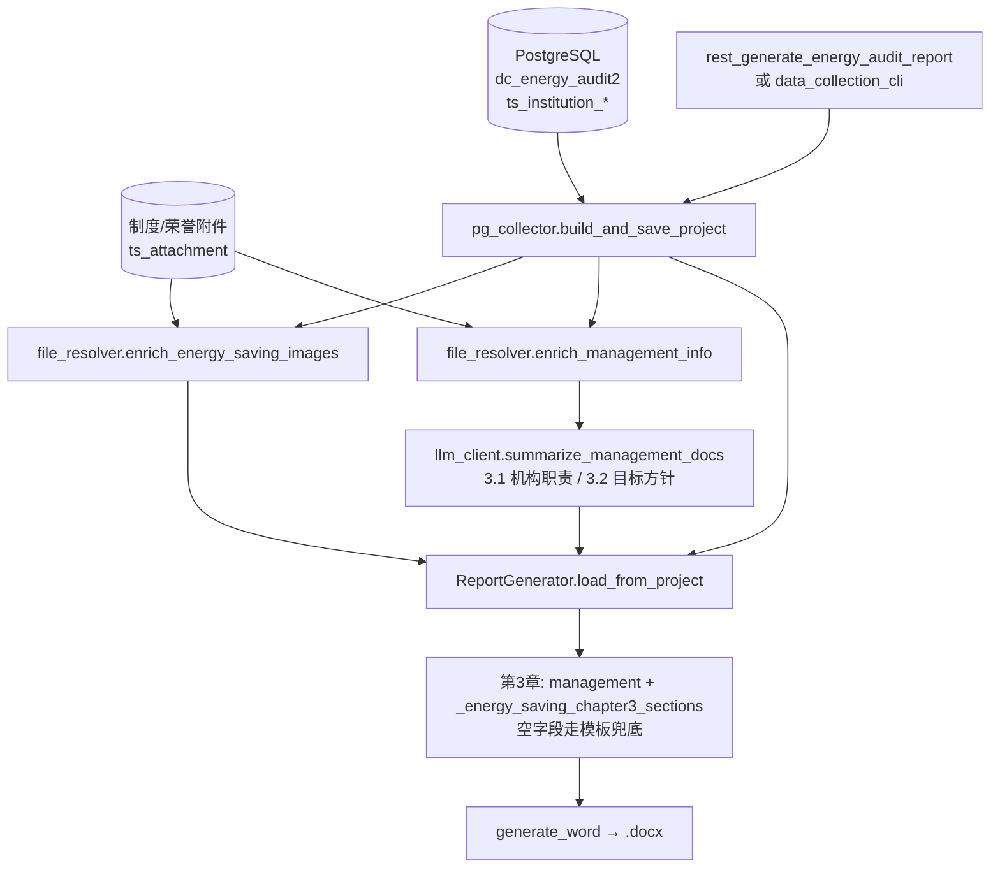
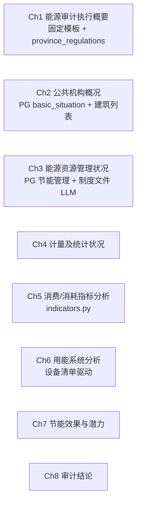

# Hermes Agent — 能源审计报告编制流程图

> 同方德诚 · 公共机构能源审计 · 现行管线（2026-08）
>
> 入口：`energy_audit_tool.rest_generate_energy_audit_report` / `data_collection_cli.py`
>
> 旧编排 `run_pipeline.py` → `agent_xiaocheng(tags)` → `search_for_chapter()` 仿写章节 **已不存在**。
> `search_for_chapter()` 仍是 RAG 库函数，但报告生成不调用。

## 主流程图



## 报告结构（8章）



第3章不再按同类报告（如省人社厅）段落结构仿写。

## 现行模块职责

| 模块 | 职责 | 核心文件 | 数据源 |
|------|------|----------|--------|
| 报告入口 | REST / CLI 触发生成 | `energy_audit_tool.py`、`data_collection_cli.py` | 项目名称 |
| 数据采集 | PG 取数、三层回退、制度文件提炼 | `pg_collector.py`、`file_resolver.py`、`llm_client.py` | PostgreSQL + 附件 |
| 指标计算 | 折标、定额对标、基准值 | `indicators.py` | `AuditProject` |
| 报告组装 | 8 章 Word | `report_generator.py` | `report_data` |
| RAG 检索 | 对话侧知识检索（**不写入报告章节**） | `rag/rag_search.py`、`energy_audit_rag_tool.py` | Qdrant |
| KG 诊断 | 因果链库函数（**未接入自动生成入口**） | `energy_kg.py`、`data_analysis.py` | 内置因果链 |

## 关键数据流

```
项目名
  → build_and_save_project() → AuditProject
      · PG ts_institution_* 
      · enrich_management_info()：制度文档 → LLM → management_org / management_policy
      · ts_institution_energy_saving → EnergySaving
  → ReportGenerator.load_from_project()
      · chapter3.section_3_1/3_2 ← management（LLM 或空）
      · chapter3.section_3_2/3_3/3_4 ← _energy_saving_chapter3_sections()
      · 空字段 ← build_chapter3() 模板兜底
  → generate_word() → {unit_name}能源审计报告.docx
```

`search_for_chapter('第3章', {'institution_category': '党政机关'})` 可手动调用检索 Qdrant，**不会进入上述管线**。

## 技术标准

| 标准 | 适用范围 |
|------|----------|
| GB/T 2589-2020 | 综合能耗计算通则（国标） |
| DB37/T 2672-2674-2019 | 山东省公共机构能耗定额标准 |
| DB37/T 标准系列 | 山东省机构/建筑/工业审计规范 |

## 机构类型支持

`institution_category` 标签值为中文（RAG payload / `ProjectBase` 一致）：

| 类型 | institution_category | 定额映射（indicators） |
|------|---------------------|------------------------|
| 医疗 | `医疗` | DB37/T 医疗类定额 |
| 党政机关 | `党政机关` | DB37/T 机关类定额 |
| 教育 | `教育` | DB37/T 教育类定额 |
| 体育场馆 | `场馆` / `体育` | DB37/T 场馆类定额 |
